## Title
Vales
## Framework
Vanilla JS
## Module 
Module 1: Document Request 
## Installation

Follow these steps to replicate and run the project on another computer:

1. Install Git and Node.js.
	- Git is required to clone the repository.
	- Node.js is required to run the local preview server.
	- On Windows, you can install both from their official installers or use package managers like `winget`.

2. Clone the repository.
	```bash
	git clone https://github.com/RyanVales10/firstattempt2026_Vales.git
	```

3. Open the project folder.
	```bash
	cd firstattempt2026_Vales
	```

4. Install dependencies if needed.
	- This project uses plain HTML, CSS, and Vanilla JavaScript, so there are no npm dependencies required for the current build.
	- If you want to keep the environment consistent, you can still run `npm install` to create a lockfile and prepare the local Node environment.

5. Start the local preview server.
	```bash
	node server.js
	```

6. Open the app in your browser.
	- The terminal will print the local address, usually `http://localhost:4173`.
	- Paste that address into your browser to view the documentation module.

7. Optional: use the provided npm script.
	```bash
	npm start
	```

If you are moving the project to a different computer, copy the entire repository folder after cloning or pull the latest changes with `git pull`.

## PWA Setup (Vanilla JS)

1. Add `manifest.json` at the project root.
2. Add `sw.js` at the project root.
3. Place icons in `icons/icon-192.png` and `icons/icon-512.png`.
4. In `index.html`, add:
	- `<meta name="theme-color" content="#0f533d" />`
	- `<meta name="background-color" content="#f5f9f7" />`
	- `<link rel="manifest" href="./manifest.json" />`
5. In `main.js`, register the Service Worker on window load.

### What is cached

- Core files: `index.html`, `styles.css`, `main.js`, `manifest.json`
- Icons: `icons/icon-192.png`, `icons/icon-512.png`
- Images: `image.png`, `image-1.png` to `image-12.png`

### Caching strategy

- Strategy: Cache First
- On request:
  - Return cached file if available
  - Otherwise fetch from network, cache it, then return it
  - For failed navigation requests while offline, return cached `index.html`

### How to test in Chrome

1. Run the app using `node server.js`.
2. Open `http://localhost:4173`.
3. Open DevTools -> Application:
	- Check **Manifest** is valid
	- Check **Service Workers** shows `sw.js` as active
4. Install prompt test:
	- Click install icon in Chrome address bar (or menu -> Install app)
5. Offline test:
	- DevTools -> Network -> set to **Offline**
	- Refresh page, app should still load cached content
	- Navigate through screens to verify offline behavior
## AI Tools used
GPT - 5.3 - Codex
## Prompt: 
Act like a Senior UI/UX Designer. Create the Documentation Module of the University Portal. Copy the User Screens attached in the PDF exactly as to how it looks like. Use Vanilla JS
## Screenshots:

- Alumni login
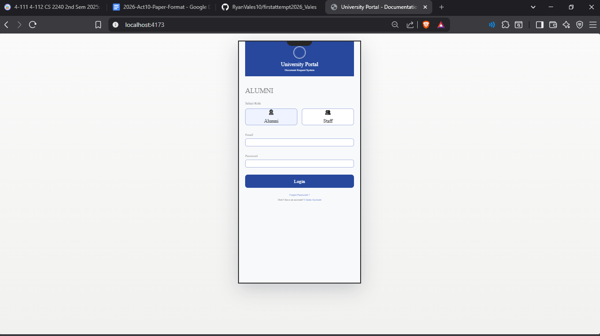
- Alumni dashboard
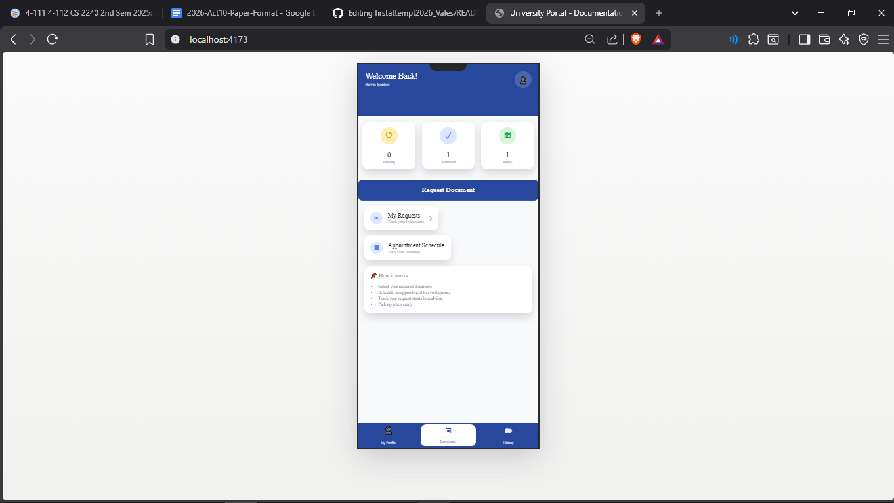
- Alumni profile
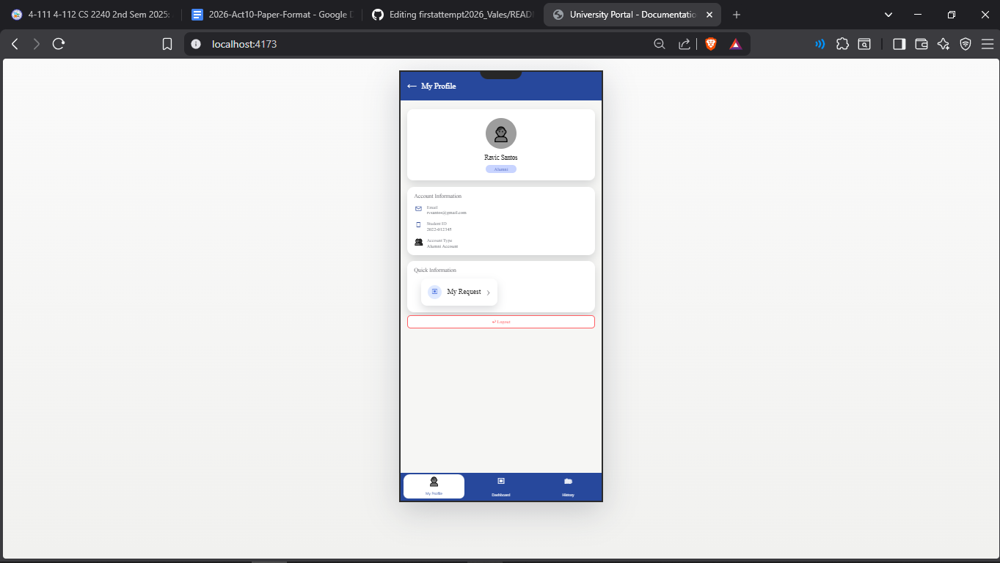
- Document selection
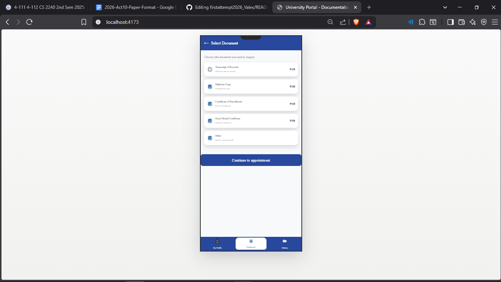
- Appointment scheduling
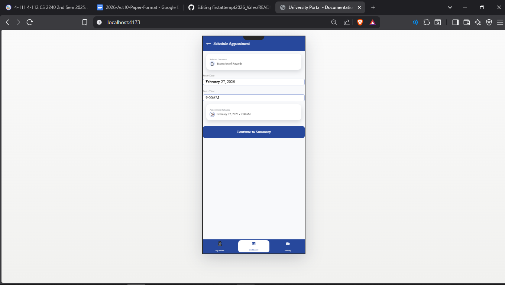
- Request review
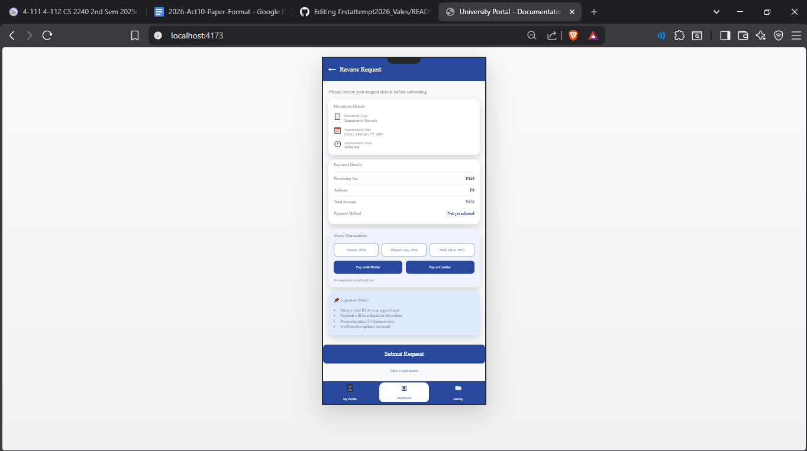
- Order tracking
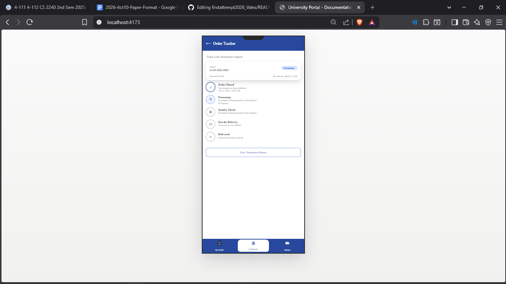
- Transaction History
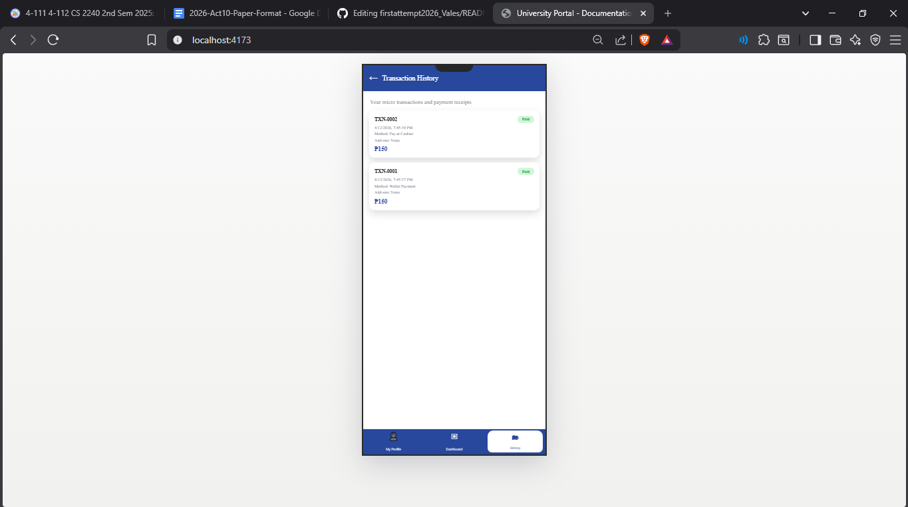
- Staff login
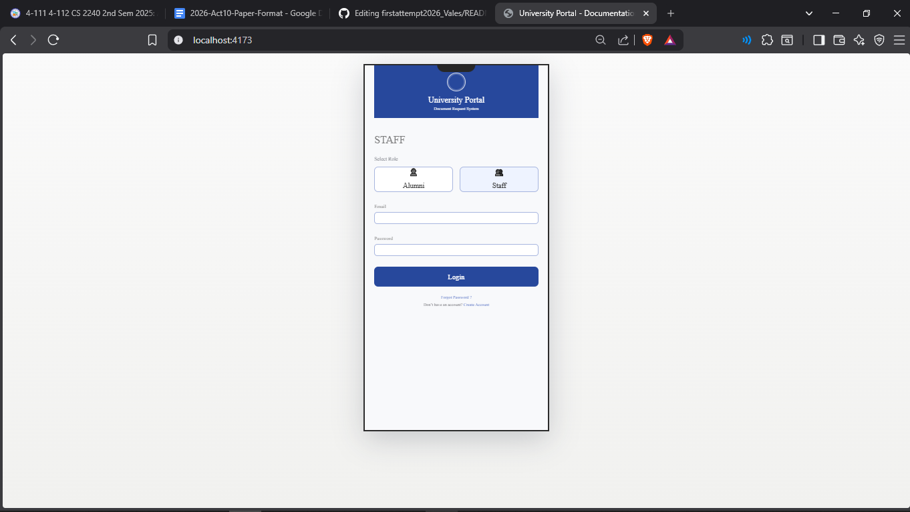
- Staff dashboard
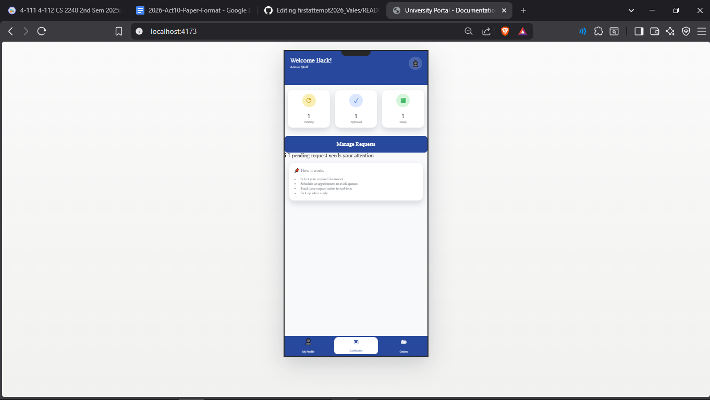
- Staff profile
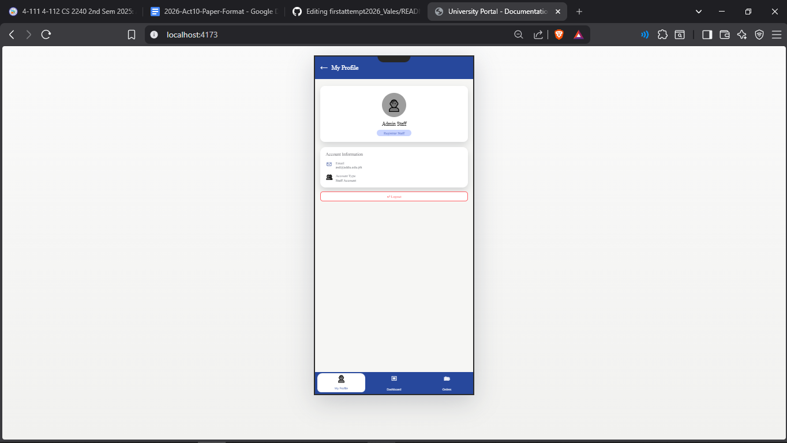
- Status Filter
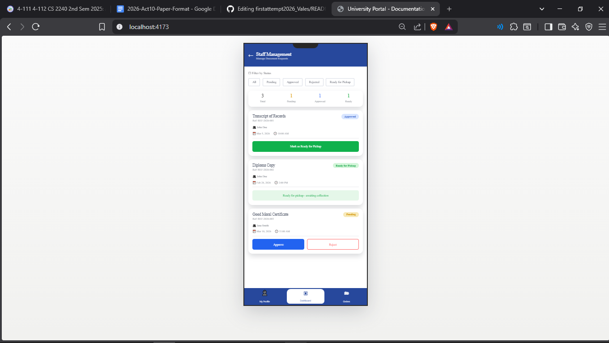

